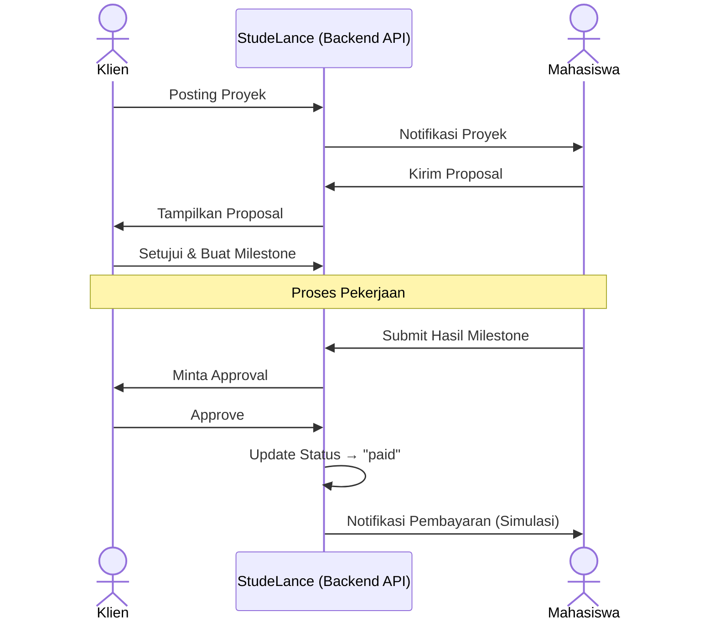
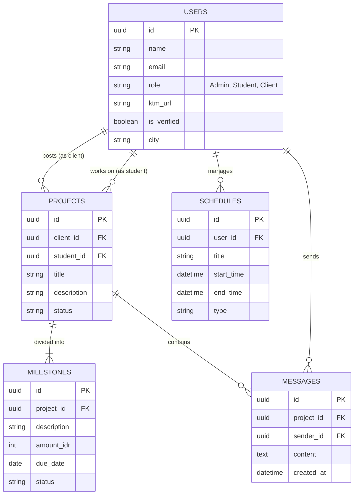

# StudeLance Monorepo

StudeLance adalah platform freelance mahasiswa berbasis **Academic Professionalism**: mahasiswa terverifikasi KTM, manajemen proyek berbasis milestone, kalender akademik sinkron, dan kolaborasi client-student dalam satu workspace.

---

## Core Features

- **Verifikasi Berbasis KTM (Manual Admin Approval):** Sebuah sistem keamanan dan kredibilitas. Mahasiswa mengunggah foto KTM mereka. Tim Admin StudeLance akan memverifikasi secara manual. Tanpa persetujuan ini, mahasiswa tidak bisa melamar pekerjaan.
- **Academic-Sync Calendar:** Fitur kalender pintar di mana mahasiswa dapat memasukkan jadwal kelas dan ujian mereka (baik diinput manual maupun sinkronisasi melalui Google Calendar). Fitur ini akan digabungkan dengan tenggat waktu proyek sehingga mahasiswa dan klien bisa mengatur jadwal *(timeline)* pekerjaan yang realistis tanpa mengorbankan nilai akademis.
- **Sistem Pembayaran Micro-Milestone (Simulasi):** Proyek dipecah menjadi beberapa tahap kecil (milestone). Setiap milestone memiliki status (pending, working, approved, paid). Sistem ini mensimulasikan alur escrow tanpa integrasi pembayaran nyata. Perubahan status dilakukan oleh sistem atau pengguna untuk merepresentasikan proses pembayaran.
- **Student-Client Community (Proyek Chat):** Ruang obrolan langsung (real-time chat) yang terikat pada setiap proyek spesifik. Memudahkan komunikasi, revisi, dan pengiriman file antara mahasiswa dan klien secara profesional dalam satu tempat.

---

## User Flow

**Perjalanan Mahasiswa (Freelancer):**
1. Mendaftar akun dan mengunggah foto KTM.
2. Menunggu persetujuan manual dari Admin (Status diverifikasi).
3. Sinkronisasi jadwal kuliah (Manual/Google Calendar) ke dalam profil.
4. Mencari proyek yang ada di kota target dan mengirimkan proposal ke klien.
5. Jika diterima, berdiskusi via fitur *Chat* untuk memecah proyek menjadi beberapa tahap (*milestone*).
6. Mengerjakan tugas berdasarkan timeline kalender yang tidak bentrok dengan kuliah.
7. Menyelesaikan tahap 1, klien menyetujui, dan bayaran tahap 1 (Rupiah) langsung masuk ke akun mahasiswa.

**Perjalanan Klien:**
1. Mendaftar akun dan memposting detail pekerjaan.
2. Melihat lamaran dari mahasiswa (yang sudah diverifikasi KTM).
3. Memilih mahasiswa yang cocok dan menyetujui jadwal/pembagian tugas (*milestone*).
4. Menyetorkan dana ke platform (StudeLance menahan dana tersebut).
5. Memantau progres via *Chat* dan menyetujui hasil kerja per tahap.
6. Dana otomatis diteruskan ke mahasiswa setelah persetujuan (dipotong biaya admin per transaksi).

---

## Arsitektur Monorepo

StudeLance menggunakan arsitektur Monorepo modern dengan pemisahan yang jelas antara frontend dan backend, serta memanfaatkan Supabase sebagai Backend-as-a-Service (BaaS).

### Struktur Sistem

```text
/studelance-repo
  /frontend  → Next.js (UI, Client-side)
  /backend   → Next.js (API Routes, Server-side)
```

### Peran Setiap Layer

- **Frontend (Next.js - TypeScript):**
  - Menyediakan antarmuka pengguna (UI)
  - Mengelola state dan data fetching menggunakan TanStack Query
  - Berkomunikasi dengan Backend API

- **Backend (Next.js API - JavaScript):**
  - Berfungsi sebagai Backend-for-Frontend (BFF)
  - Menangani business logic (verifikasi KTM, project, milestone)
  - Menjadi perantara antara frontend dan Supabase
  - Mengamankan akses data (validasi request)

- **Supabase:**
  - PostgreSQL Database (relasi data utama)
  - Authentication (login/register user)
  - Storage (penyimpanan file seperti KTM)

### Alur Data

1. User berinteraksi melalui Frontend (Vercel)
2. Frontend mengirim request ke Backend API
3. Backend memproses logic dan berkomunikasi dengan Supabase
4. Data dikembalikan ke Frontend untuk ditampilkan

### Catatan Payment Gateway

Payment Gateway hanya digunakan sebagai **simulasi alur transaksi (formalitas)** dan tidak memproses pembayaran nyata. Sistem pembayaran akan direpresentasikan melalui status di database (misalnya: pending, approved, paid).



---

## Database Schema

Berikut adalah tabel utama yang dibutuhkan sistem untuk berjalan, dirancang agar mudah dikembangkan (scalable). Schema ini mendukung fitur verifikasi, manajemen proyek, milestone pembayaran, dan sinkronisasi jadwal.

- **Users:** Menyimpan data semua pengguna. Memiliki kolom `role` (Admin/Student/Client), `ktm_url` (foto KTM), dan `is_verified` (status persetujuan admin).
- **Projects:** Menyimpan informasi pekerjaan yang diposting klien. Berisi `title`, `description`, `budget`, `client_id`, dan `student_id` (jika sudah ada yang terpilih).
- **Project_Members (Pivot Table):** Menghubungkan user dengan project (many-to-many). Memungkinkan satu project memiliki banyak mahasiswa atau mentor. Berisi `id`, `project_id`, `user_id`, dan `role` (student / mentor).
- **Milestones:** Memecah proyek menjadi pembayaran kecil. Berhubungan dengan *Projects*. Memiliki kolom `project_id`, `description`, `amount` (dalam Rupiah), `due_date`, dan `status` (Pending/Funded/Completed/Paid).
- **Schedules:** Menyimpan jadwal akademik mahasiswa dan jadwal proyek. Berisi `user_id`, `title`, `start_time`, `end_time`, `type` (Class/Exam/Project_Deadline).
- **Messages:** Menyimpan percakapan antara klien dan mahasiswa. Berisi `project_id`, `sender_id`, `content`, dan `timestamp`.



---

## Tech Stack

- **Frontend & Kerangka Kerja:** **Next.js** - **Tailwind CSS** - **shadcn/ui**
- **Backend & Database:** **Next.js API (JavaScript)** - **Supabase (PostgreSQL)** - **Supabase Auth** - **Supabase Storage**

---

## Akun Demo (3 Role)

> Disediakan melalui script seed. Jika email/password berbeda, cek `backend/scripts/seed-test-users.js`.

| Role    | Email (default seed)          | Password (default seed) |
|---------|-------------------------------|-------------------------|
| Admin   | `admin1@studelance.local`     | Admin12345!             |
| Student | `student@studelance.com`      | password123             |
| Client  | `client@studelance.com`       | password123             |

---

## Status Fitur Utama di Project Saat Ini

- ✅ **Academic-Sync Calendar** (frontend `app/(protected)/calendar`, backend `api/schedules`)
- ✅ **KTM-Based Verification** (frontend komponen verifikasi + admin moderation, backend `api/student/verifications`, `api/admin/verifications`, `api/admin/users`)
- ✅ **Micro-Milestone Payments (Simulation)** (backend `api/milestones`, `api/payments`, status milestone)
- ✅ **Student-Client Community (Project Chat)** (backend `api/messages`, frontend flow proyek & kolaborasi)

---

## Menjalankan Project

1. Jalankan backend (lihat `backend/README.md`)
2. Jalankan frontend (lihat `frontend/README.md`)
3. Login dengan akun demo sesuai role